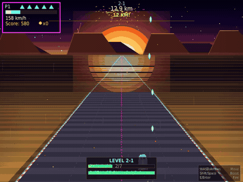
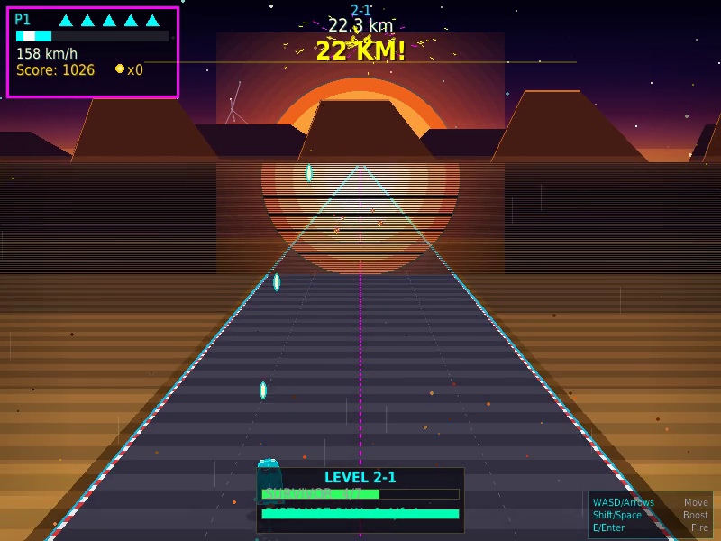
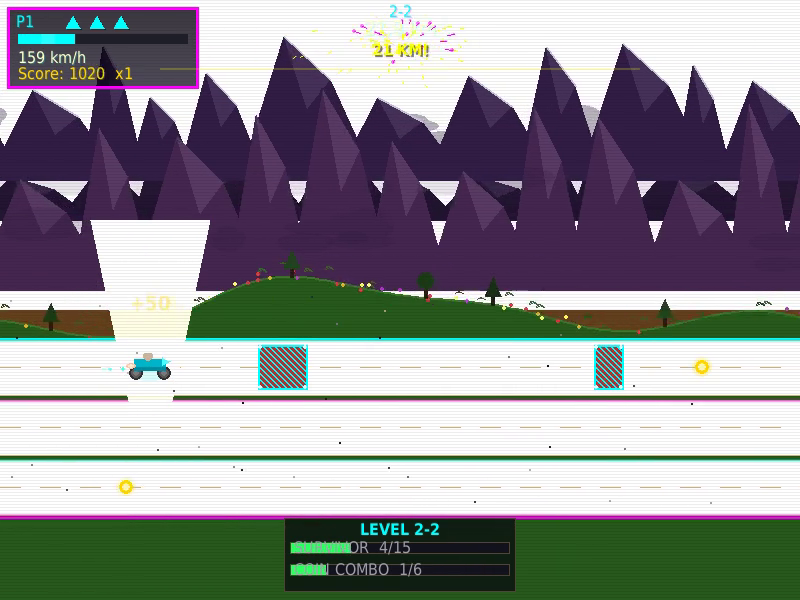
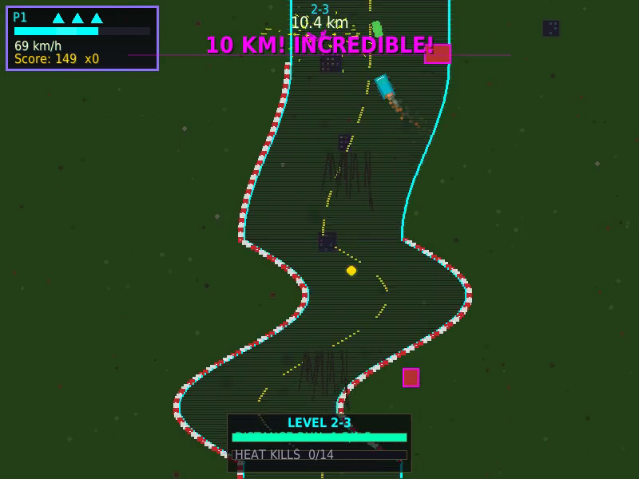

<p align="center">
  <br>
  
  
  
  
  <br><br>
</p>

```
 ███╗   ██╗███████╗ ██████╗ ███╗   ██╗    ██████╗ ██╗   ██╗███████╗██╗  ██╗
 ████╗  ██║██╔════╝██╔═══██╗████╗  ██║    ██╔══██╗██║   ██║██╔════╝██║  ██║
 ██╔██╗ ██║█████╗  ██║   ██║██╔██╗ ██║    ██████╔╝██║   ██║███████╗███████║
 ██║╚██╗██║██╔══╝  ██║   ██║██║╚██╗██║    ██╔══██╗██║   ██║╚════██║██╔══██║
 ██║ ╚████║███████╗╚██████╔╝██║ ╚████║    ██║  ██║╚██████╔╝███████║██║  ██║
 ╚═╝  ╚═══╝╚══════╝ ╚═════╝ ╚═╝  ╚═══╝    ╚═╝  ╚═╝ ╚═════╝ ╚══════╝╚═╝  ╚═╝
```

<h3 align="center">
  A three-perspective arcade racer with boss rush mechanics — zero external assets, 100% procedural.
</h3>

<p align="center">
  <b>Desert Velocity</b> (vertical) → <b>Excitebike</b> (side-scroll) → <b>Micro Machines</b> (top-down) → <b>Victory</b>
</p>

<p align="center">
  
  <br>
  <sub><a href="assets/neon_rush_demo.mp4">Watch full 60s demo video</a></sub>
</p>

---

## What Is This?

NEON RUSH is a **~7,700-line Pygame game** built entirely from code — no sprites, no audio files, no textures. Every visual, sound effect, and music track is **synthesized at runtime** using math and procedural generation.

You race through three completely different game perspectives, each with its own physics, mechanics, and boss fight. Beat all three bosses to win. Then do it again at higher tiers where everything gets harder and looks better.

**Key facts:**
- **35+ Python files**, zero asset files
- **38 procedural sound effects** + 6 synthesized music tracks
- **3 unique boss encounters** with multi-phase AI and vulnerability windows
- **Q-learning AI** that trains itself to play (and gets pretty good)
- **Self-healing crash recovery** — the game diagnoses and fixes its own errors
- **1-player and 2-player** support

---

## Quick Start

```bash
git clone https://github.com/KHET-1/NEON-RUSH.git
cd NEON-RUSH
python3 -m venv .venv
.venv/bin/pip install pygame
.venv/bin/python neon_rush.py
```

That's it. No asset downloads, no build step, no configuration.

---

## The Three Modes

### Mode 1: Desert Velocity — Vertical Racer



- Classic top-down vertical scrolling
- **Leap dodge:** double-tap left/right for an instant 90px dash
- **Solar flares** damage the boss if you survive them
- Boss: **Sandstone Golem** — sandstorm columns, boulder barrages, dive attacks

### Mode 2: Excitebike — Side-Scroll Lanes



- 3-lane system with smooth transitions
- **Ramps** launch you airborne — skip obstacles and deal boss damage
- **Mud patches** slow you down
- Boss: **Armored Motorcycle** — shockwaves, missile barrages, charge attacks

### Mode 3: Micro Machines — Top-Down Free-Roam



- True 2D movement with rotation-based steering
- **Drift mechanic:** turning at speed generates extra heat
- **Oil slicks** cause angular deflection
- Boss: **Monster Truck** — shockwave rings, homing missiles, tire barrages

---

## Core Mechanics

### Heat System

Heat is the central resource. Everything flows through it.

```
  Accelerate ──→ Heat builds (+1.0–1.5/frame)
                      │
            ┌─────────┼──────────┐
            ▼         ▼          ▼
     BOOST (manual)  FIRE BOLT  OVERFLOW (100%)
     Consume all     40 heat     Ghost Mode
     Speed burst     15 HP dmg   5s invincible
```

### Boss Fights

Every boss follows the same contract but feels completely different:

| Phase | HP Range | What Changes |
|-------|----------|-------------|
| **Phase 1** | 100%–66% | Basic attacks, learn the patterns |
| **Phase 2** | 66%–33% | New attacks, faster, less recovery |
| **Phase 3** | 33%–0% | Full arsenal, minimal vulnerability |

**Three ways to deal damage:**
1. **RAM** — collide during vulnerability window
2. **Heat Bolt** — fire projectiles (costs 40 heat, 30-frame cooldown)
3. **Environmental** — use the level against the boss

### Task System

Before each boss, complete 2 randomly assigned tasks from a pool of 12:

| Task | What You Do |
|------|------------|
| Coin Rush | Collect N coins |
| Score Target | Reach N points |
| Heat Kills | Destroy N obstacles with heat bolts |
| Combo Chain | Build an Nx combo multiplier |
| Survivor | Go N seconds without getting hit |
| Near Miss | Dodge N obstacles at close range |
| Speed Demon | Maintain max speed for N seconds |
| Ramp Master | Launch off N ramps *(Excitebike)* |
| Drift King | Drift for N frames *(Micro Machines)* |

### Evolution Tiers

Beat all 3 bosses and the game loops at a higher tier:

| Tier | Era | Boss HP | Visuals |
|------|-----|---------|---------|
| **Tier 1** | NES | 1.0x | Basic sprites, simple FX |
| **Tier 2** | SNES | 1.3x | Enhanced graphics, pseudo-3D |
| **Tier 3** | N64+ | 1.6x | Full polish, screen effects |

---

## Controls

### Single Player

| Key | Action |
|-----|--------|
| `W` / `↑` | Accelerate (builds heat) |
| `S` / `↓` | Brake / lane down / reverse |
| `A` / `←` | Steer left |
| `D` / `→` | Steer right |
| `E` / `Space` | Fire heat bolt |
| `LShift` | Boost (consumes heat) |
| `P` / `Esc` | Pause |
| `F11` | Toggle fullscreen |
| `F2` | Toggle 1x/2x scale |

### Two Player

| | Player 1 | Player 2 |
|--|----------|----------|
| **Move** | `WASD` | Arrow keys |
| **Fire** | `E` | `Return` |
| **Boost** | `LShift` | `RShift` |

---

## CLI Flags

```bash
# Standard play
python3 neon_rush.py                       # Default start
python3 neon_rush.py --windowed            # Windowed mode
python3 neon_rush.py -m excitebike         # Start at Excitebike
python3 neon_rush.py -m micro -t 3         # Micro Machines, tier 3

# Testing & debug
python3 neon_rush.py --god                 # Invincible mode
python3 neon_rush.py --boss-rush           # Boss spawns in ~5s
python3 neon_rush.py --ai                  # AI plays automatically

# AI Training
python3 autoplay.py --learn -r 6 -s 6 --headless   # Fast headless training
python3 autoplay.py --grid --learn                   # 6 learning AIs in a grid
python3 autoplay.py --grid -s 4 --god                # 6 god-mode games at 4x
```

---

## AI System

NEON RUSH includes a **Q-learning AI** that teaches itself to play through trial and error.

**State space:** Player position, threat direction/distance, heat level, boss state
**Action space:** 12 actions (3 movement x 2 boost x 2 fire)
**Learning:** Tabular Q-learning with epsilon-greedy exploration

```bash
# Train the AI (headless, maximum speed)
python3 autoplay.py --learn --headless -s 6 -r 6

# Watch 6 AIs learn simultaneously
python3 autoplay.py --grid --learn

# The brain persists to .neon_rush_brain.json between sessions
```

The AI trains across runs, gradually learning to dodge obstacles, manage heat, and fight bosses. After enough training, it consistently reaches the later modes.

---

## Powerups

9 powerup types spawn during gameplay. All award +100 points on pickup.

| Icon | Powerup | Duration | Effect |
|------|---------|----------|--------|
| `S` | **Shield** | 16.7s | Absorbs one hit |
| `M` | **Magnet** | 13.3s | Auto-attracts nearby collectibles |
| `~` | **Slow-Mo** | 8.3s | Everything at 50% speed |
| `!` | **Nuke** | Instant | Destroys all on-screen obstacles |
| `G` | **Phase** | 10s | Ghost mode — pass through hazards |
| `N` | **Surge** | 5s | Max speed + invincible |
| `W` | **Multishot** | 10s | Fire 3-bolt fan spread |
| `R` | **Rockets** | 13.3s | Auto-fire homing rockets |
| `8` | **Orbit8** | 16.7s | 8 orbiting damage orbs |

---

## Difficulty

| | Easy | Normal | Hard |
|--|------|--------|------|
| **Lives** | 5 | 3 | 2 |
| **Obstacles** | 0.6x | 1.0x | 1.5x |
| **Boss HP** | 0.75x | 1.0x | 1.4x |
| **Boss Windows** | 1.4x wider | 1.0x | 0.7x tighter |
| **Coin Spawn** | Every 30f | Every 40f | Every 50f |
| **Powerup Spawn** | Every 200f | Every 300f | Every 450f |

---

## Architecture

```
neon_rush.py                  Main entry — state machine, CLI, game loop
├── core/                     Engine layer (16 files)
│   ├── constants.py          All game tuning constants
│   ├── sound.py              38 procedural SFX + 6 music tracks
│   ├── particles.py          Particle system (800 cap)
│   ├── hud.py                Score, lives, task bars, heat gauge
│   ├── tasks.py              12 task types, progress tracking
│   └── ...                   fonts, shake, vfx, display, combo, crash recovery
├── shared/                   Game contracts (7 files)
│   ├── game_mode.py          Base class — all modes inherit this
│   ├── boss_base.py          Boss contract (3 phases, vulnerability)
│   ├── player_state.py       Persistent state across mode transitions
│   └── ...                   transitions, powerups, projectiles
├── modes/                    The three game perspectives
│   ├── desert_velocity.py    Vertical scroller
│   ├── excitebike.py         Side-scroll lanes
│   └── micromachines.py      Top-down free-roam
├── bosses/                   Boss encounters (multi-phase AI)
│   ├── desert_boss.py        Sandstone Golem (7 attack patterns)
│   ├── excitebike_boss.py    Armored Motorcycle (6 attack patterns)
│   └── micromachines_boss.py Monster Truck (6 attack patterns)
├── sprites/                  Game entities (procedurally drawn)
├── backgrounds/              Parallax backgrounds (procedural)
├── ai/                       Q-learning AI system
│   ├── autoplay.py           Training runner (grid, single, headless)
│   ├── learning_brain.py     Q-table, reward functions, SmartKeys
│   ├── game_instance.py      Isolated game for grid mode
│   └── run_stats.py          Statistics tracking
└── autoplay.py               CLI entry for AI training
```

**Design principles:**
- **Fixed timestep** — 36 Hz simulation decoupled from render (up to 144 FPS)
- **Zero assets** — every pixel, sound, and melody is generated by code
- **Self-healing** — corrupt saves auto-reset, display crashes auto-recover
- **Atomic saves** — all JSON writes use tempfile → fsync → os.replace

---

## Self-Healing

The game includes a crash recovery system. If something goes wrong:

1. A crash report is auto-saved to `crash_logs/` with full session state
2. The error is diagnosed and a fix hint is displayed
3. Corrupt data files (highscores, brain state) auto-reset
4. Display driver failures trigger fallback mode on next launch

| Error | Auto-Fix |
|-------|----------|
| Corrupt `highscores.json` | Reset to `[]` |
| Display driver crash | Store `SDL_VIDEODRIVER=x11` for next run |
| JSON decode error | Restore from `.bak` backup |
| Memory overflow | Particle cap enforced at 800 |

---

## If It Doesn't Run

```bash
# Most common fix — reinstall pygame
.venv/bin/pip install --force-reinstall pygame

# Display issues on Linux
SDL_VIDEODRIVER=x11 .venv/bin/python neon_rush.py

# No sound device
SDL_AUDIODRIVER=dummy .venv/bin/python neon_rush.py

# Headless (CI/servers)
SDL_VIDEODRIVER=dummy SDL_AUDIODRIVER=dummy .venv/bin/python neon_rush.py
```

---

## Contributing

The project uses a structured pipeline documented in `BUILD_BOARD.md`:

```
BACKLOG → WIP → REVIEW → COMPLETE
```

Key files for contributors:
- **[AI_CHECKIN.md](AI_CHECKIN.md)** — Project doctrine and contributor guidelines
- **[BUILD_BOARD.md](BUILD_BOARD.md)** — Task pipeline and open work
- **[GAME_DESIGN.md](GAME_DESIGN.md)** — Full game design specification

---

## License

MIT
